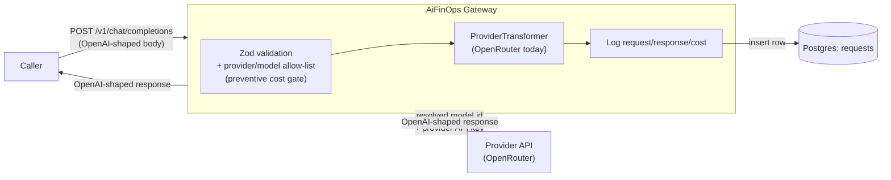

# AiFinOps — Architecture & Technical Reference

This document covers how AiFinOps processes a request internally, its full configuration
surface, the database schema, and how to extend it with a new provider. For the pitch,
quickstart, and roadmap, see the [README](README.md).

## Request flow

A caller sends a standard OpenAI-shaped request to `POST /v1/chat/completions` with a
gateway-flavored model string (`"<provider>/<providerModelId>"`, e.g.
`"openrouter/openai/gpt-4o"`).



The handler in `src/routes/chatCompletions.ts` runs, in this exact order:

1. Validate the optional attribution headers (`AiFinOps-*`, see [Attribution
   headers](#attribution-headers) below) against a Zod schema. An oversized value is rejected
   with a `400` before anything else runs. Valid values are parsed once and carried through
   every log entry written for this request, on every path below.
2. Validate the request body against a Zod schema modeling OpenAI's Chat Completions request
   shape. If `stream: true` is present, reject immediately with a `400` — streaming isn't
   supported yet, and it's never silently ignored or faked.
3. Split `model` on the **first** `/`. Everything before it is the `provider`; everything after
   it is the `providerModelId`, which may itself contain more slashes (e.g. `openai/gpt-4o`).
4. Look up `provider` in `config/providers.json`. If missing, `400 {"error": "provider not
provisioned: <provider>"}`.
5. Look up `providerModelId` in `config/providerModelMap.json[provider]`. If missing, `400
{"error": "model not provisioned for provider <provider>: <providerModelId>"}`.
6. Resolve a `ProviderTransformer` for `provider` via `src/transformers/registry.ts`.
7. The transformer builds the outbound request — for OpenRouter, that's `POST
{baseUrl}/chat/completions` with the caller's body, `model` swapped for the resolved
   `providerModelId`, and (if the provider declares one) `Authorization: Bearer` attached from
   the gateway's own environment. If building the request fails (e.g. a missing API key), that's
   caught, logged to Postgres as a `status: 'error'` row, and returned as a `500` — never an
   unhandled crash. The transformer only ever receives the parsed body — never the attribution
   headers — so attribution data cannot reach the provider even by accident.
8. Send the request, capture wall-clock latency.
9. On success, `parseResponse` validates the response shape and explicitly extracts the `usage`
   object for logging, rather than re-serializing the upstream body blindly.
10. **Before responding to the caller**, insert one row into the `requests` table — full request,
    full response (or error), every usage/cost field available, and the attribution values from
    step 1.
11. Return the (still OpenAI-shaped) response to the caller with the original upstream status
    code.
12. On any failure (network error, non-2xx upstream, invalid response shape), a row is still
    logged with `status = 'error'` and the error message. A logging failure itself never crashes
    the request handler — it's caught and printed to server logs so it's at least visible
    operationally.

## Repository structure

```
src/
  server.ts                  Fastify app bootstrap, fail-fast checks, provider readiness log
  config/
    env.ts                   Zod schema for process.env — infra vars only (PG*, PORT, NODE_ENV)
    providers.ts              Loads/validates config/providers.json, provider readiness check
    providerModelMap.ts       Loads/validates config/providerModelMap.json
  routes/
    chatCompletions.ts        POST /v1/chat/completions handler
    health.ts                  GET /health handler
  transformers/
    types.ts                  ProviderTransformer interface
    openrouter.ts              OpenRouterTransformer implementation
    registry.ts                 provider name -> transformer instance lookup
  db/
    pool.ts                    pg Pool, built from PG* env vars
    logRequest.ts               insert one row per request/response
  schemas/
    chatCompletionRequest.ts    Zod schema for the inbound OpenAI-shaped body
    attribution.ts               Zod schema for the optional attribution headers
config/
  providers.json                which providers are provisioned
  providerModelMap.json         which model IDs are provisioned per provider
scripts/
  setup-db.ts                   creates the DB (if missing) + tables — `npm run setup-db`
```

## Environment variables

| Variable             | Required at boot?               | Purpose                                                                        |
| -------------------- | ------------------------------- | ------------------------------------------------------------------------------ |
| `PGUSER`             | Yes                             | Postgres username                                                              |
| `PGHOST`             | Yes                             | Postgres host                                                                  |
| `PGDATABASE`         | Yes                             | Postgres database name                                                         |
| `PGPASSWORD`         | Yes                             | Postgres password                                                              |
| `PGPORT`             | Yes                             | Postgres port (default `5432`)                                                 |
| `PORT`               | Yes                             | Gateway HTTP port (default `8787`)                                             |
| `NODE_ENV`           | Yes (defaults to `development`) | `development` \| `production` \| `test`                                        |
| `OPENROUTER_API_KEY` | No — checked per-provider       | OpenRouter API key. Only needed if you actually call the `openrouter` provider |

`PGUSER`/`PGHOST`/`PGDATABASE`/`PGPASSWORD`/`PGPORT`/`PORT`/`NODE_ENV` are validated with Zod
once at startup (`src/config/env.ts`). If any are missing or invalid, the process prints exactly
which ones and exits non-zero — it never starts in a partially-configured state. The gateway
also runs a `SELECT 1` against Postgres before accepting any HTTP traffic and exits if the
database isn't reachable.

**Provider credentials are handled differently, on purpose.** `config/providers.json` can list
more providers than a given deployment actually uses, so a specific provider's key (like
`OPENROUTER_API_KEY`) is deliberately _not_ part of the fixed env schema above — requiring every
provider's key just to boot would break a deployment that only uses one of them. Instead:

- At startup, the gateway checks each entry in `providers.json` against `process.env` and logs
  which providers are actually usable (`✅ Providers ready: openrouter`). If a provider is listed
  but its key is missing, that's a non-fatal warning, not a boot failure. If _no_ provider is
  ready at all, a single warning is printed.
- At request time, the first call to a provider whose key is missing fails cleanly — caught,
  logged to the `requests` table as `status: 'error'`, and returned as a `500`.
- A provider can also be defined **without** `apiKeyEnvVar` at all (e.g. a local Ollama
  endpoint) — in that case no key is checked, ever, at boot or at request time.

## Provider & model provisioning

Two hand-edited JSON files gate what the gateway will actually call. This is a deliberate
compliance/cost-control mechanism, not just routing convenience — a model not listed here is
rejected with a `400` even if the upstream provider would happily serve it.

**`config/providers.json`** — which providers are provisioned at all:

```json
{
  "openrouter": {
    "displayName": "OpenRouter",
    "baseUrl": "https://openrouter.ai/api/v1",
    "apiKeyEnvVar": "OPENROUTER_API_KEY"
  }
}
```

`apiKeyEnvVar` is optional — omit it for a keyless/local provider and no `Authorization` header
is ever attached for it.

**`config/providerModelMap.json`** — which model IDs are allowed per provider, using each
provider's own native model naming (for OpenRouter, its `vendor/model` IDs):

```json
{
  "openrouter": ["openai/gpt-4o", "openai/gpt-4o-mini", "anthropic/claude-3.5-sonnet"]
}
```

To allow a new OpenRouter model, add its OpenRouter model ID to the `"openrouter"` array and
restart the gateway:

```json
{
  "openrouter": [
    "openai/gpt-4o",
    "openai/gpt-4o-mini",
    "anthropic/claude-3.5-sonnet",
    "mistralai/mistral-large"
  ]
}
```

Callers then address it as `"openrouter/mistralai/mistral-large"` in their request's `model`
field (the gateway splits on the _first_ `/`; everything after it — including any further
slashes — is passed through as-is to the provider).

## Database schema

`scripts/setup-db.ts` (run via `npm run setup-db`):

1. Connects to the default `postgres` maintenance database using the `PG*` env vars (overriding
   `PGDATABASE` to `postgres` for this one connection).
2. Checks `pg_database` for an existing database named from `PGDATABASE`; creates it with
   `CREATE DATABASE` only if it doesn't already exist (Postgres has no `CREATE DATABASE IF NOT
EXISTS`).
3. Reconnects to the now-existing target database and creates the `requests` table and its
   indexes if they don't exist:

```sql
CREATE TABLE IF NOT EXISTS requests (
  id                    BIGSERIAL PRIMARY KEY,
  created_at            TIMESTAMPTZ NOT NULL DEFAULT now(),
  provider              TEXT NOT NULL,
  requested_model       TEXT NOT NULL,      -- raw "provider/model" string the caller sent
  resolved_model_id     TEXT NOT NULL,      -- what was actually sent upstream, e.g. "openai/gpt-4o"
  request_body          JSONB NOT NULL,     -- exact payload sent to the provider
  response_body         JSONB,              -- exact payload received back (null on hard failure)
  status                TEXT NOT NULL,      -- 'success' | 'error'
  http_status_code      INTEGER,
  error_message         TEXT,
  prompt_tokens         INTEGER,
  completion_tokens     INTEGER,
  total_tokens          INTEGER,
  cached_tokens         INTEGER,
  cache_write_tokens    INTEGER,
  reasoning_tokens      INTEGER,
  cost                  NUMERIC(12, 6),     -- OpenRouter's own reported cost, in credits
  upstream_inference_cost NUMERIC(12, 6),   -- from usage.cost_details.upstream_inference_cost
  latency_ms            INTEGER NOT NULL,
  region_id             TEXT,               -- optional attribution, see below
  environment           TEXT,
  tenant_id             TEXT,
  application_id        TEXT,
  module_id             TEXT,
  process_or_user_id    TEXT,
  transaction_id        TEXT
);

CREATE INDEX IF NOT EXISTS idx_requests_created_at ON requests (created_at);
CREATE INDEX IF NOT EXISTS idx_requests_provider_model ON requests (provider, resolved_model_id);
CREATE INDEX IF NOT EXISTS idx_requests_tenant_id ON requests (tenant_id);
CREATE INDEX IF NOT EXISTS idx_requests_application_id ON requests (application_id);
CREATE INDEX IF NOT EXISTS idx_requests_tenant_app ON requests (tenant_id, application_id);
CREATE INDEX IF NOT EXISTS idx_requests_transaction_id ON requests (transaction_id);
```

`npm run setup-db` is idempotent and safe to re-run against an existing database — it also issues
`ALTER TABLE ... ADD COLUMN IF NOT EXISTS` for each attribution column, so upgrading an
already-running deployment just means running it again.

`src/db/logRequest.ts` accepts a typed object covering every column above and performs the
insert — called from the route handler on both the success and every failure path. It never
throws; a logging failure is caught and printed to server logs instead of crashing the request.

Example query — total cost by model over the last 24 hours:

```sql
SELECT resolved_model_id, COUNT(*) AS calls, SUM(cost) AS total_cost
FROM requests
WHERE created_at > now() - interval '24 hours'
GROUP BY resolved_model_id
ORDER BY total_cost DESC;
```

## Attribution headers

Optional cost-attribution metadata a caller can send alongside a request. Captured in the
`requests` table for later filtering/dashboarding; **never forwarded to the LLM provider.**

| Header                        | DB column            | Description                                 |
| ----------------------------- | -------------------- | ------------------------------------------- |
| `AiFinOps-Region-Id`          | `region_id`          | Geographic or cloud infrastructure zone     |
| `AiFinOps-Environment`        | `environment`        | Deployment stage                            |
| `AiFinOps-Tenant-Id`          | `tenant_id`          | Client or organization account              |
| `AiFinOps-Application-Id`     | `application_id`     | Macro-level software application or service |
| `AiFinOps-Module-Id`          | `module_id`          | Sub-system or component within the app      |
| `AiFinOps-Process-Or-User-Id` | `process_or_user_id` | System process ID or the active user ID     |
| `AiFinOps-Transaction-Id`     | `transaction_id`     | Unique trace ID for one request workflow    |

All optional, all free-form strings capped at 255 characters (`src/schemas/attribution.ts`); an
oversized value is rejected with a `400` before anything else runs — no fixed vocabulary is
enforced, values are entirely caller-defined.

Conceptually, these nest (documentation only — not enforced via foreign keys or a hierarchy
table in the schema):

```
[Level 1: Global Scope]      Infrastructure (RegionId)
                                     │
[Level 2: Stage Scope]       Environment
                                     │
[Level 3: Client Scope]      Tenant / Organization (TenantId)
                                     │
[Level 4: System Scope]      Application (ApplicationId)
                                     │
[Level 5: Component Scope]   Sub-System (ModuleId)
                                     │
[Level 6: Context Scope]     Actor / Executor (ProcessOrUserId)
                                     │
[Level 7: Runtime Scope]     Execution Path (TransactionId)
```

**Why headers, not a body field:** `transformer.buildRequest()` only ever receives the parsed
OpenAI-shaped body, never `request.headers` — so attribution data cannot reach the provider by
construction, not because of a "strip this field before forwarding" step that a future refactor
could accidentally break.

**Indexing:** `tenant_id`, `application_id`, their combination, and `transaction_id` are indexed
up front, since they map directly to the attribution questions already in the README ("cost by
tenant/app," "total cost of one workflow"). `region_id`/`environment`/`module_id`/
`process_or_user_id` are left unindexed until real dashboard query patterns justify the
write-cost of an index on every insert.

## Health endpoint

`GET /health` — no auth, safe to expose publicly, reports no secrets or business data:

```json
{
  "status": "ok",
  "version": "0.1.1",
  "uptimeSeconds": 3421,
  "database": "reachable",
  "providers": { "openrouter": "ready" }
}
```

Returns `200` if Postgres is reachable (re-running the same `SELECT 1` check used at boot),
`503` otherwise. `providers` reflects `getProviderReadiness()` per provider in
`config/providers.json` — informational only, it does not affect the status code or HTTP status.
Implementation: `src/routes/health.ts`.

## Extending AiFinOps — adding a new provider

`src/transformers/types.ts` defines the seam the whole architecture is built around:

```ts
interface ProviderTransformer {
  readonly providerName: string;
  buildRequest(params: BuildRequestParams): OutboundRequest;
  parseResponse(rawResponse: unknown): ParsedResponse;
}
```

`buildRequest` turns our internal (OpenAI-shaped) request into whatever the upstream provider
actually expects; `parseResponse` validates and normalizes what comes back, extracting usage/cost
for logging. Adding a new provider (Anthropic native, Gemini, a local Ollama endpoint, etc.)
means:

1. Implement `ProviderTransformer` in a new file, e.g. `src/transformers/anthropic.ts`.
2. Add an entry for it in `config/providers.json`.
3. Add its allowed model IDs to `config/providerModelMap.json`.
4. Register an instance of it in `src/transformers/registry.ts`.

**No changes to `src/routes/chatCompletions.ts` are required** — the route only ever talks to
the `ProviderTransformer` interface, never to a concrete provider.

## Development

| Command                                   | Purpose                                                                 |
| ----------------------------------------- | ----------------------------------------------------------------------- |
| `npm run dev`                             | Start the gateway with hot reload (`tsx watch`)                         |
| `npm run build`                           | Type-checks and compiles to `dist/` (fails the build on any type error) |
| `npm run start`                           | Runs the compiled build (`node dist/src/server.js`)                     |
| `npm run typecheck`                       | `tsc --noEmit` — no build output, just type errors                      |
| `npm run setup-db`                        | Creates the database (if missing) and the `requests` table              |
| `npm run lint` / `npm run lint:fix`       | ESLint                                                                  |
| `npm run format` / `npm run format:check` | Prettier                                                                |

A Husky pre-commit hook runs `tsc --noEmit` and lint-staged (ESLint) before every commit, so
type errors are caught before they're even committed, not just at build/runtime.

`tsconfig.json` runs with `strict: true`, `noUncheckedIndexedAccess: true`, and
`noImplicitAny: true` — the goal is that a broken provider-string parse, a missing config field,
or a mismatched request/response shape gets caught by `tsc` or by Zod inference, not discovered
from a 500 in production.
