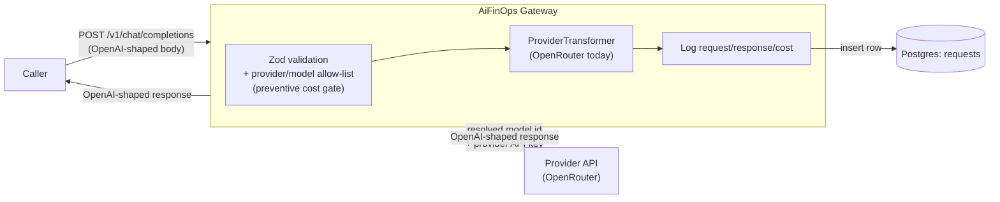

# AiFinOps

AiFinOps is a self-hosted **LLM gateway built for cost governance**. It gives teams visibility,
control, and governance over LLM usage and cost — starting with an OpenAI-compatible gateway
that validates, routes, and logs every request before it ever reaches a provider.

It accepts requests in OpenAI's Chat Completions format, validates them against a
compliance-gated allow-list of providers and models, forwards the request to an actual LLM
provider, and logs full request/response/cost detail to Postgres before handing an
OpenAI-shaped response back to the caller.

## Why AiFinOps

Once a team starts calling LLM providers directly, spend gets hard to see and even harder to
control. Provider API keys end up scattered across every service that calls them. Any client
can call any model — including the most expensive ones — with nothing stopping it before the
call goes out. And the first real signal of a problem is usually the invoice, not a warning.

AiFinOps exists to close that gap with **preventive** controls, not just after-the-fact
reporting:

- **Nothing gets called unless it's explicitly provisioned.** Providers and models are gated by
  an allow-list (`config/providers.json`, `config/providerModelMap.json`). A request for a model
  that isn't on the list is rejected with a `400` before it ever reaches the provider — so a
  stray client, a bad config, or a newly released (and pricier) model can't silently rack up
  spend.
- **Provider credentials never leave the gateway.** API keys live only in the gateway's
  environment, not in every calling service, so spend can't happen anywhere except through this
  single, audited front door.
- **Every call is logged, in full, before the response is returned.** Full request/response
  bodies, token counts, and cost are written to Postgres for every request — success or failure
  — giving you a complete, queryable record of what was spent and on what model.

**What v1 does today:** request/response capture and cost logging, scoped to the request itself
(model, tokens, cost, latency), for OpenRouter only.

**What v1 does not do yet:** attribute that spend to a tenant, application, end user, or
transaction. That's the next layer — see [Upcoming Features](#upcoming-features) — and the
request-level logging this version ships is the foundation it will be built on.

## Questions AiFinOps helps you answer

AiFinOps is built to answer questions like these:

- What is our total expense across all models over a given time period (last 24 hours, 7
  days, 30 days, etc.)?
- What is our total expense for each provider over a given time period?
- Which application team is driving the most cost?
- Which users of my SaaS app are costing the most?
- What is the average multi-turn chat session cost for each user of my app?
- Is our LLM spend trending up or down week-over-week, and at what rate?
- What is our projected LLM spend trend for the rest of this period, based on current usage?
- Which model or provider gives us the best cost-per-successful-response for a given type of
  task?
- How much would we save (or lose) by switching a given workload from one model to a
  cheaper/pricier one?
- Which teams or apps are attempting to call models outside their approved list?
- Which tenant, team, or app has the highest spend trend this period?
- What's the cost breakdown per feature or use case within a single application?

The first two are answerable today by querying the `requests` table directly (see the example
query below). The rest depend on cost attribution and a usage dashboard, both of which are
actively being built — see [Upcoming Features](#upcoming-features).

## Architecture

A caller sends a standard OpenAI-shaped request to `POST /v1/chat/completions` with a
gateway-flavored model string (`"<provider>/<providerModelId>"`, e.g.
`"openrouter/openai/gpt-4o"`). The gateway validates the request body, checks that the provider
and model are both provisioned — this is the preventive cost-control gate — resolves a
`ProviderTransformer` for that provider, and uses it to build and send the actual upstream HTTP
request, attaching the provider's API key itself so callers never see or supply provider
credentials. The upstream response is validated, its usage/cost fields are extracted, the full
exchange is logged to Postgres, and the (still OpenAI-shaped) response is returned to the
caller.



**V1 supports exactly one provider: [OpenRouter](https://openrouter.ai/).** The internal
architecture is built around a `ProviderTransformer` interface so that native transformers for
other providers (Anthropic, Gemini, etc.) can be added later as new files, without touching the
request-handling flow. See [Upcoming Features](#upcoming-features).

## Setup

Prerequisites: Node.js 20+, a running Postgres server, and an OpenRouter API key.

```bash
npm install
cp .env.example .env
# then edit .env: fill in your Postgres credentials and OPENROUTER_API_KEY
npm run setup-db
npm run dev
```

`npm run setup-db` creates the `aifinops` database (if it doesn't already exist) and the
`requests` table. `npm run dev` starts the gateway with hot reload on `PORT` (default `8787`).

## Environment variables

| Variable             | Purpose                                                                                |
| -------------------- | -------------------------------------------------------------------------------------- |
| `PGUSER`             | Postgres username                                                                      |
| `PGHOST`             | Postgres host                                                                          |
| `PGDATABASE`         | Postgres database name (`aifinops`)                                                    |
| `PGPASSWORD`         | Postgres password                                                                      |
| `PGPORT`             | Postgres port (default `5432`)                                                         |
| `OPENROUTER_API_KEY` | OpenRouter API key. Loaded server-side only — callers of the gateway never supply this |
| `PORT`               | Port the gateway HTTP server listens on (default `8787`)                               |
| `NODE_ENV`           | `development` \| `production` \| `test`                                                |

All of these are validated with Zod once at startup (`src/config/env.ts`). If any are missing
or invalid, the process prints exactly which ones and exits with a non-zero code — it will
never start in a partially-configured state. The gateway also runs a `SELECT 1` against
Postgres before accepting any HTTP traffic and exits if the database isn't reachable.

## Provider & model provisioning

Two hand-edited JSON files gate what the gateway will actually call. This is the deliberate
compliance/cost-control mechanism described above, not just routing convenience — a model not
listed here is rejected with a `400` even if the upstream provider would happily serve it.

**`config/providers.json`** — which providers are provisioned at all:

```json
{
  "openrouter": {
    "displayName": "OpenRouter",
    "baseUrl": "https://openrouter.ai/api/v1",
    "apiKeyEnvVar": "OPENROUTER_API_KEY"
  }
}
```

**`config/providerModelMap.json`** — which model IDs are allowed per provider, using each
provider's own native model naming (for OpenRouter, its `vendor/model` IDs):

```json
{
  "openrouter": ["openai/gpt-4o", "openai/gpt-4o-mini", "anthropic/claude-3.5-sonnet"]
}
```

To allow a new OpenRouter model, add its OpenRouter model ID to the `"openrouter"` array in
`config/providerModelMap.json` and restart the gateway. For example, to allow
`"mistralai/mistral-large"`:

```json
{
  "openrouter": [
    "openai/gpt-4o",
    "openai/gpt-4o-mini",
    "anthropic/claude-3.5-sonnet",
    "mistralai/mistral-large"
  ]
}
```

Callers then address it as `"openrouter/mistralai/mistral-large"` in their request's `model`
field (the gateway splits on the _first_ `/`; everything after it — including any further
slashes — is passed through as-is to the provider). Because provisioning is explicit and
opt-in, adding a model is a deliberate cost-governance decision, not something that happens by
accident.

## Using it once hosted

Once the gateway is running (`npm run dev` or `npm run start`), point any OpenAI Chat
Completions-compatible client at it, using a gateway-flavored `model` string instead of a raw
OpenAI model name.

```bash
curl -s http://localhost:8787/v1/chat/completions \
  -H "Content-Type: application/json" \
  -d '{
    "model": "openrouter/openai/gpt-4o-mini",
    "messages": [{ "role": "user", "content": "Say hello in one sentence." }]
  }'
```

Expected response (OpenAI-shaped, with OpenRouter's usage/cost accounting included):

```json
{
  "id": "gen-xxxxxxxx",
  "object": "chat.completion",
  "created": 1734000000,
  "model": "openai/gpt-4o-mini",
  "choices": [
    {
      "index": 0,
      "message": { "role": "assistant", "content": "Hello! Hope you're having a great day." },
      "finish_reason": "stop"
    }
  ],
  "usage": {
    "prompt_tokens": 14,
    "completion_tokens": 11,
    "total_tokens": 25,
    "cost": 0.000123,
    "prompt_tokens_details": { "cached_tokens": 0 },
    "completion_tokens_details": { "reasoning_tokens": 0 },
    "cost_details": { "upstream_inference_cost": 0.0001 }
  }
}
```

Every call — success or failure — is also inserted as a row in the `requests` table in
Postgres, with the full request body, full response body, every usage/cost field OpenRouter
reports, and wall-clock latency. That table is your source of truth for spend: for example, to
see total cost by model over the last 24 hours:

```sql
SELECT resolved_model_id, COUNT(*) AS calls, SUM(cost) AS total_cost
FROM requests
WHERE created_at > now() - interval '24 hours'
GROUP BY resolved_model_id
ORDER BY total_cost DESC;
```

## Upcoming Features

AiFinOps is under active development. We'll keep adding to this list as we grow — near-term
priorities:

- **Additional provider support** — native Anthropic, Gemini, and other provider transformers,
  each with a maintained pricing table for accurate cost accounting beyond what OpenRouter
  reports today. The `ProviderTransformer` interface (`src/transformers/types.ts`) is designed
  so this means adding a new file and registering it in `src/transformers/registry.ts`, with no
  changes to `src/routes/chatCompletions.ts`.
- **Cost attribution to tenant / application / user / transaction** — roll up spend by tenant,
  app, end user, or transaction, on top of today's request-level logging.
- **Spend limits at the model and application level** — configurable soft and hard limits, so
  spend can be capped before it happens, not just observed after the fact.
- **A usage dashboard** — a UI for visualizing spend, volume, and trends over time, instead of
  querying Postgres directly.

And further out:

- Streaming response support (`stream: true` is currently rejected with a `400`).
- Inbound gateway authentication.
- Per-tenant / per-team model provisioning scoping (today provisioning is global).
- Normalized cross-provider error shapes.
- Retry/fallback logic.
- An `extra_body`-style escape hatch for provider-native-only parameters not in the OpenAI
  shape.

## Changelog

All notable changes to this project are documented here. Dates are in `YYYY-MM-DD` format.

### 0.1.0 — 2026-08-19

Initial release.

- OpenAI-compatible `POST /v1/chat/completions` endpoint.
- OpenRouter provider support via the `ProviderTransformer` interface.
- Provider/model allow-list gate (`config/providers.json`,
  `config/providerModelMap.json`) as a preventive cost-control mechanism.
- Full request/response/cost logging to Postgres (`requests` table), success or failure.
- Zod-validated environment configuration with fail-fast startup checks.
- Postgres connectivity check (`SELECT 1`) before accepting HTTP traffic.
