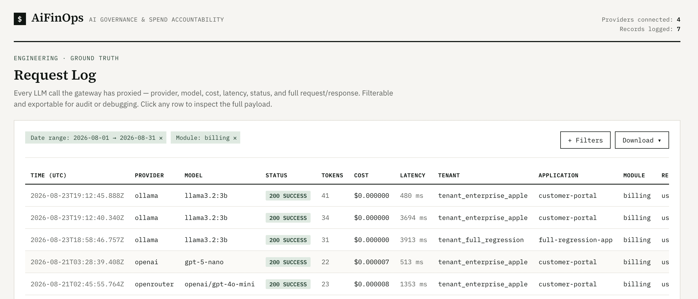

# 💸 AiFinOps



AiFinOps is a self-hosted, OpenAI-compatible **LLM gateway built for cost governance**. Every
call your team makes to an LLM — provider, model, tokens, cost — passes through one audited
front door, gated by an allow-list you control, before it ever reaches a provider.

Unlike calling a provider SDK directly, nothing goes out that wasn't explicitly approved, no
credential ever leaves the gateway, and every call is written to Postgres before the response
even comes back — so you have a permanent, queryable spend record from day one, not a project
you have to bolt on after the first surprising invoice.

## 📊 Why AiFinOps

Sound familiar?

- "How much are we spending on LLMs this month — and is it growing?"
- "Which team or app is driving that spend?"
- "How much of that spend is going to calls that failed anyway?"
- "Could we be paying less for the same task on a different model?"
- "Is anyone calling a model we never approved?"

If your team can't answer these today, you're one invoice away from an uncomfortable
conversation. AiFinOps exists so you can answer them before your VP or CFO asks — with
**preventive** controls, not just after-the-fact reporting:

- **Nothing gets called unless it's explicitly provisioned.** A request for a model that isn't
  on your allow-list is rejected with a `400` before it ever reaches the provider.
- **Provider credentials never leave the gateway.** One audited front door, not a key scattered
  across every service that calls an LLM.
- **Every call is logged, in full, before the response is returned.** Full request/response
  bodies, tokens, and cost — a complete record of what was spent and on what.

**Available today:**

- Full request-level cost logging across providers like OpenRouter, OpenAI, Anthropic, Ollama, etc.
- Optional attribution tags (tenant, application, module, user, transaction, region, environment)
  captured on every call
- A Spend Overview dashboard with rolling trends, top spenders, and a per-application chargeback
  rollup
- A self-service Report Builder for ad hoc analysis
- A logs screen for searching and inspecting individual calls without SQL
- Every view is filterable, shareable, and bookmarkable — filters and the active tab live in the
  URL

See [Changelog](#changelog) for release history.

→ For exactly how requests are validated, routed, and logged, see
[ARCHITECTURE.md](ARCHITECTURE.md).

## 🚀 Get Started

Prerequisites: Node.js 20+, a running Postgres server, and an API key for at least one provider
you plan to use (OpenAI, Anthropic, Ollama etc.)

```bash
npm install
cp .env.example .env
# edit .env: fill in your Postgres credentials, plus OPENROUTER_API_KEY, OPENAI_API_KEY,
# and/or ANTHROPIC_API_KEY
npm run setup-db
npm run dev
```

> ⚠️ **v1 has no inbound authentication** (same default as most self-hosted LLM gateways, e.g.
> LiteLLM without a master key). Anyone who can reach this port can make LLM calls billed to
> your account. Don't expose it beyond a trusted network.

Then call it like any OpenAI Chat Completions endpoint, using a gateway-flavored `model` string
(`"<provider>/<providerModelId>"`):

```bash
curl -s http://localhost:8787/v1/chat/completions \
  -H "Content-Type: application/json" \
  -d '{
    "model": "openrouter/openai/gpt-4o-mini",
    "messages": [{ "role": "user", "content": "Say hello in one sentence." }]
  }'
```

That's it — the response comes back OpenAI-shaped, and the call is already logged to Postgres
with full request/response and cost detail, success or failure.

**To browse what's been logged**, build the dashboard once and it's served alongside the API:

```bash
npm run build:frontend
npm run dev   # or npm run build && npm run start for a production run
```

Then open `http://localhost:8787` — **Spend Overview** for a 30-day pulse-check plus a filterable
drill-down into top spenders, provider/model breakdowns, and a per-application chargeback rollup;
**Logs** to filter by date, provider, model, status, tenant, application, region, or user
(free-text fields match anywhere in the value), inspect any call's full request/response, and
export the filtered results as CSV or a full JSONL dump; and **Report Builder** to pivot the same
data yourself — drag any field into rows or columns to answer a new question without waiting on a
new dashboard. Every filter and tab lives in the URL, so a specific view can be bookmarked or
shared with a teammate. For frontend-only hot reload while iterating on the UI, run `npm run
dev:frontend` in a second terminal instead — its dev server proxies API calls to the backend on
`:8787`.

## 🗺️ Future Roadmap

Directions we're exploring next:

- **New provider onboarding** - broaden coverage beyond OpenAI, Anthropic, Ollama, etc.
- **Financial projections** - forecast where spend is headed, not just where it's been.
- **Budget, policy & quota enforcement** - cap spend by tenant/application/user etc. before it happens.
- **Task-level cost analysis for agentic workflows** - break spend down by task within a
  multi-call agent chain, using existing attribution tags.

## Changelog

All notable changes to this project are documented here. Dates are in `YYYY-MM-DD` format.

### 1.1.0 — 2026-09-07

- **Spend Overview dashboard** — Open one page and know right away if your AI costs are climbing,
  without pulling logs or building a report. Total spend, request volume, and average cost per
  call each show a percent change vs. the prior 30 days (once you have that much history). Drill
  down further to see who's actually driving the bill — top spenders by tenant, application, or
  user — and how spend splits across providers and models.
- **Wasted-spend visibility** — See exactly how much money went to API calls that failed anyway —
  you paid for nothing. Shown as its own number, plus a per-application breakdown, so you can tell
  which application is quietly burning money on errors instead of guessing.
- **Report Builder** — Build your own cost report by dragging fields — tenant, application,
  provider, model, cost, tokens, and more — into rows and columns yourself. No more asking an
  engineer to build a dashboard for a one-off question.
- **Shareable, bookmarkable views** — Whatever tab you're on and whatever filters you've applied
  are saved in the page's URL. Copy the link and send it to a coworker — they land on the exact
  same view, no need to explain which filters to click. Back/forward in the browser also works as
  expected.

### 1.0.0 — 2026-08-30

- **Native OpenAI and Anthropic support** — call either directly, no OpenRouter hop required,
  under the exact same allow-list, logging, and attribution guarantees as every other provider.
- **Ollama support** — run models locally, or via Ollama Cloud.
- **A logs dashboard** — search and filter every call by date, provider, model, status, tenant,
  application, region, or user, without writing SQL. Export data as CSV or, JSONL(untruncated
  request/response bodies for deeper investigation) formats.
- **Built-in pricing for OpenAI and Anthropic's current model lineups** — cost is computed
  automatically from published rates, no manual entry needed to get accurate spend data from day
  one.
- **Bring your own negotiated pricing for exact cost visibility.** Supports, if your enterprise has
  negotiated custom or discounted rates with a provider — including separate rates for
  cached-token discounts and cache-write costs.
- **New runnable examples** showing cost attribution against OpenAI, Anthropic, and a free local
  Ollama model, in both Node.js and curl.

### 0.1.1 — 2026-08-23

- **Licensing clarified** — [Elastic License 2.0](LICENSE) plus an attribution requirement: free
  to use, modify, and redistribute for personal, commercial, or enterprise purposes.
- **A health check endpoint** — a safe, no-auth-required way to monitor whether the gateway and
  its database are up, suitable for load balancers and uptime monitoring.
- **Cost attribution tagging** — tag every call with your own business context (tenant,
  application, team, user, region, environment, transaction), so spend can be broken down by
  who's actually driving it, without any of that data ever reaching the LLM provider. See
  [ARCHITECTURE.md](ARCHITECTURE.md#attribution-headers).
- **Runnable examples** in Node.js and curl — a real call, a call tagged with attribution, and
  what happens when an unapproved model is requested.
- **Enterprise-grade audit logging** — an optional, file-based audit trail suitable for
  ingestion into a SIEM like Splunk, with every entry traceable back to the same request across
  logs and the database.

### 0.1.0 — 2026-08-19

Initial release — an OpenAI-compatible gateway to OpenRouter, with a compliance-gated allow-list
of approved providers and models, full request/response/cost logging to Postgres for every call,
and fail-fast startup checks so misconfiguration is caught immediately rather than in
production.

---

For the full technical reference — architecture diagram, request flow, environment variables,
database schema, and how to add a new provider — see **[ARCHITECTURE.md](ARCHITECTURE.md)**.

## License

AiFinOps is licensed under the [Elastic License 2.0](LICENSE), plus one supplemental term. You're
free to use, modify, and redistribute it — including for commercial and enterprise purposes —
with two conditions: you may not offer it, or a modified version of it, to third parties as a
hosted or managed service; and any redistribution must include a visible attribution link back
to [github.com/ankurngm/AiFinOps](https://github.com/ankurngm/AiFinOps).

## Author

Created by [Ankur Nigam](https://www.linkedin.com/in/ankurnigam/).
